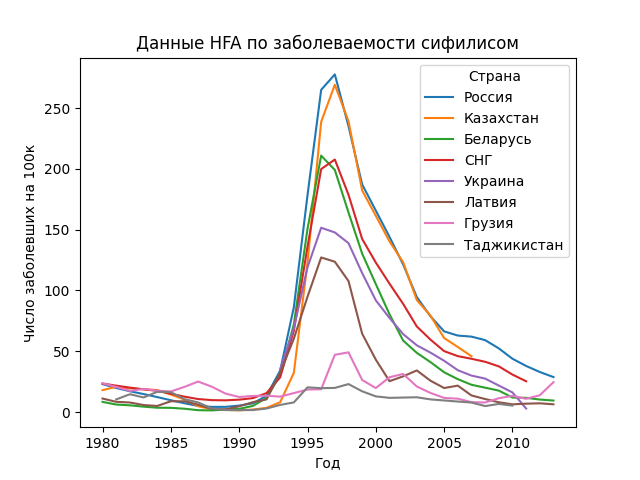

# Анализ данных заболеваемости сифилисом по годам
Были построены графики заболеваемости сифилисом на 100 000 населения.
### По данным Росстата

### По данным HFA

## Установка
### Установка виртуального окружения
```shell
pip install virtualenv
python -m venv venv
```
#### Windows
```shell
.\venv\Scripts\activate
```
#### Linux
```shell
. /venv/bin/activate
```
### Установка зависимостей
```shell
pip install -r requirements.txt
```
## Запуск
```shell
python main.py
```